# CIS 566 Homework 2: Implicit Surfaces

## Stephanie Goldberg - slgold
- Demo: https://slgold95.github.io/hw02-raymarching-sdfs/
- Helps to zoom out a bit once the scene is loaded. You just need to zoom out until you can see the top of the Bomb's head, then you should be good.

## References
- IQ's blog for SDFs: http://www.iquilezles.org/www/articles/distfunctions/distfunctions.htm
- Class Slides of Toolbox Functions: https://cis700-procedural-graphics.github.io/files/toolbox_functions.pdf
- Class Slides on Noise: https://docs.google.com/presentation/d/e/2PACX-1vQAK1Xeb7GGqLoDFz_iu9JuXMb-qE9jqKbZDkrXNSybXweqeIn3xvv4LMxetcM9GEugoU0Q0Ft1qUH-/pub?start=false&loop=false&delayms=60000&slide=id.g4cae677c4f_0_852
- CIS 560 Ray Casting Slides: https://docs.google.com/presentation/d/e/2PACX-1vSNy2AZVsoTFcstvadcN76wLX8vouFxEaWWhz8olaxCDhTFiwt5mJXIkK1hKeIhU6vxrkUoVIod-WYG/pub?start=false&loop=false&delayms=60000&slide=id.g27215b64c6_0_187
- Class Slides on Implicit Surfaces: https://docs.google.com/presentation/d/e/2PACX-1vQYxMlaG9BEf8FiLLu0nOKGuIku2G2FyGAZcKO1tNJy4RriVxR6eDPTTGw9nRbuMJ7wjAvu5szsw-yR/pub?start=false&loop=false&delayms=60000&slide=id.p
- Jamie Wong blog for Normal Calculations: http://jamie-wong.com/2016/07/15/ray-marching-signed-distance-functions/#surface-normals-and-lighting
- FBM and Noise: https://thebookofshaders.com/13/
- 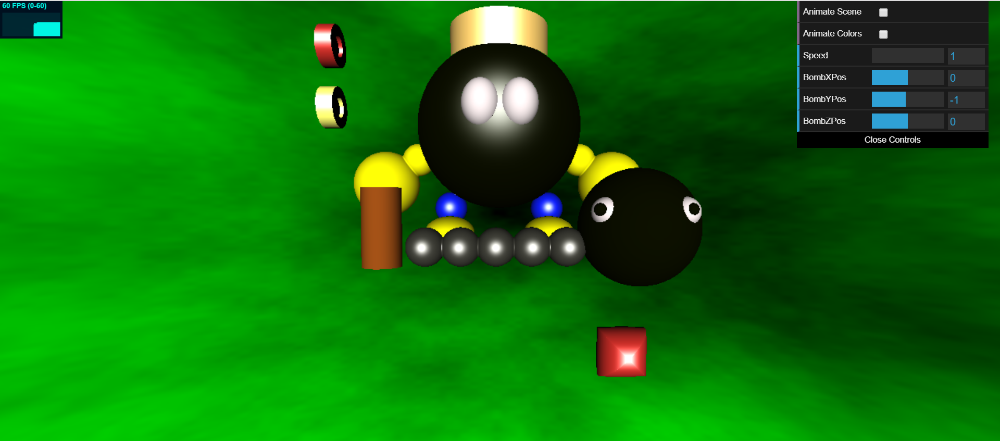

## SDF Shapes
- Use of Subtraction operation to create the indentations in the coins.
- Use of Intersection operation to create the red interesting shape in the bottom right (from two ellipsoids).
- 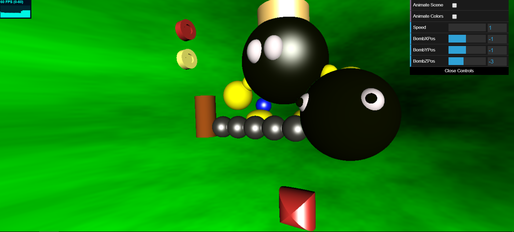
- Use of Smooth Blend to combine the balls of the chain and the Bomb's arms to his hands.
- 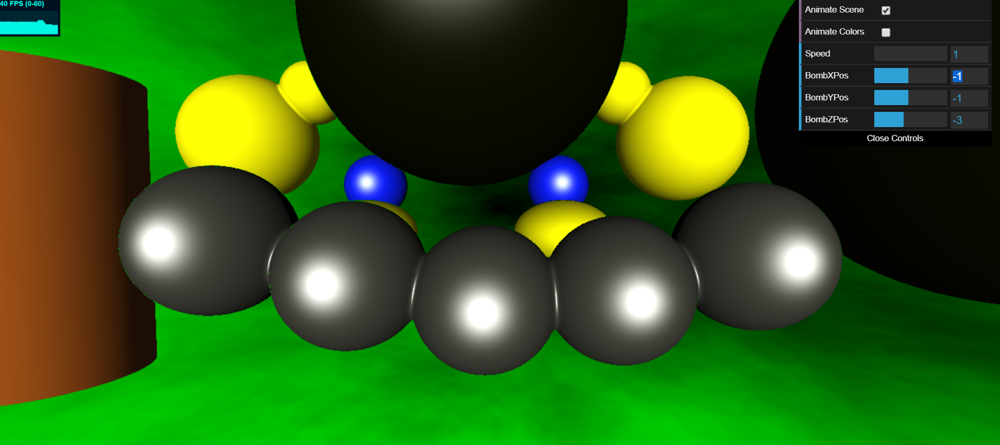
  
## Animation  
- "Animate" button on the GUI.
- Animated the position and rotation of objects in the scene. The Chain Chomp and chain move up and down, the red shape at the bottom changes position, and the coins both rotate.
- 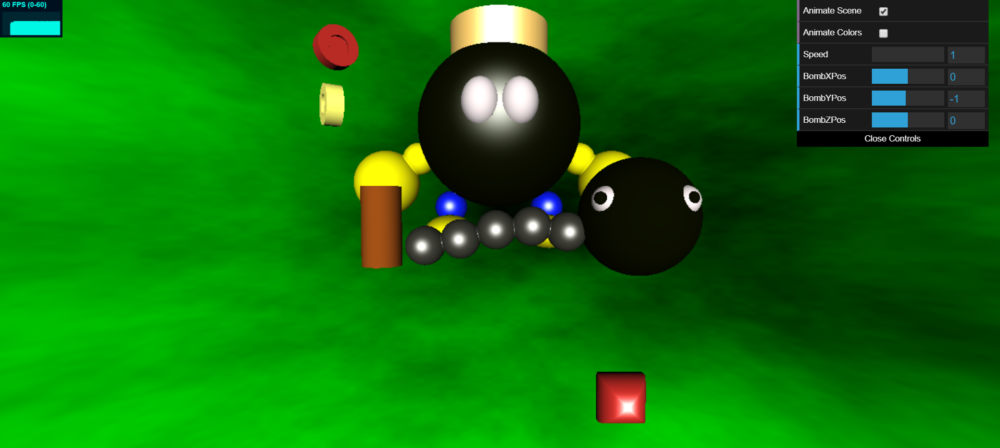

- "Animate Colors" button on the GUI.
- Animate the colors of the Bomb's arms, hands, feet, and eyes.
- 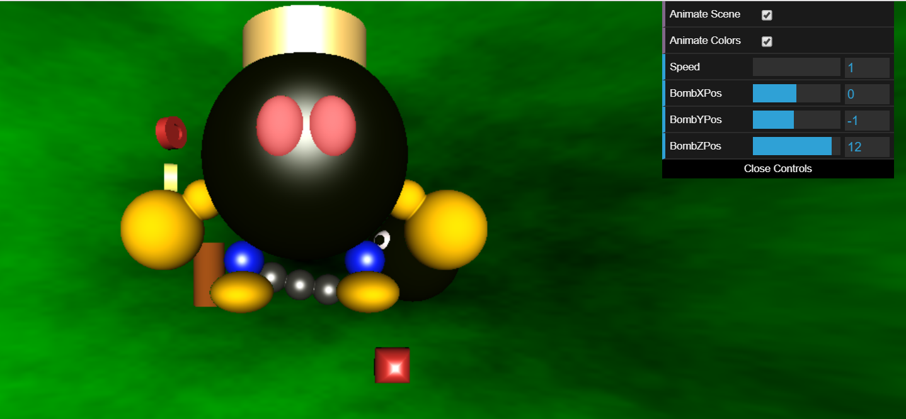
- 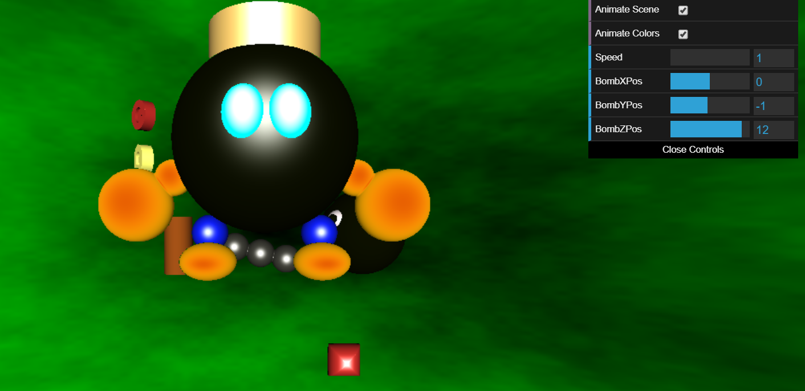
- 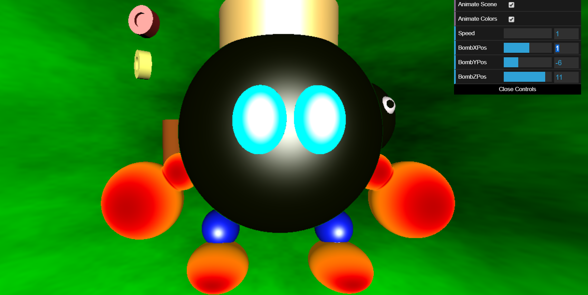
- 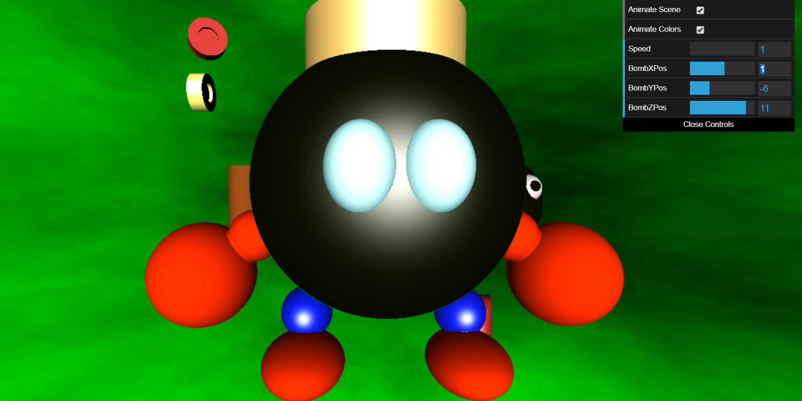
  
## Toolbox Functions
- Bias and Gain used to enhance brighter colors.
- Quadratic Easing In and Out and mix functions used to animate the change in color for the Bomb's eyes, arms, hands, and feet. Used to create a fading effect between the colors.
- Square Wave function used to animate the position of the red interesting shape at the bottom right to move it instantaneously between two positions.
- Sawtooth Wave function used to animate the repeated/jittery rotation of the yellow coin.

## Texturing and Shading
- Fractal Brownian Motion, Noise, Bias, and Gain used to texture the background.
- Blinn Phong and Lambertian shading (involved calculating surface normals).
- Certain shapes are colored with Lambertian Shading, and others are colored with Blinn Phong Shading. The distinction was a conscious choice based on materials.
- 
  
## GUI Elements
- Slider to modify the speed at which the animations are occuring. The higher the value, the quicker the shapes move.
- 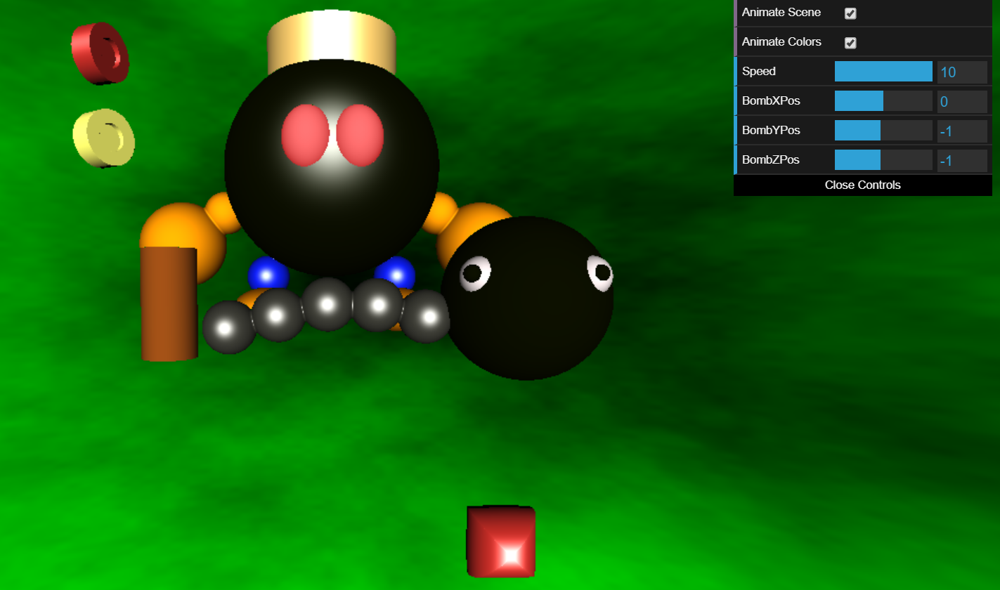
- Sliders to modify the X, Y, and Z components of the Bomb character's position.
- 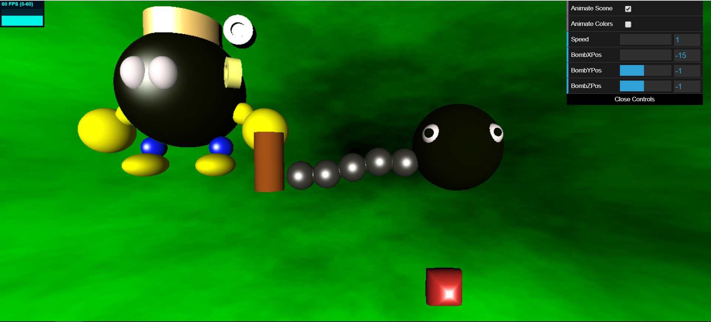
- 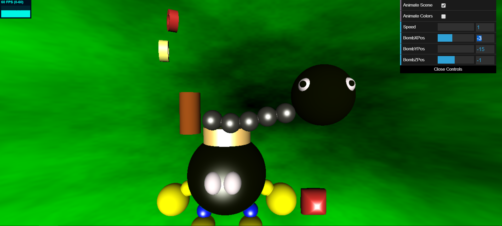
- 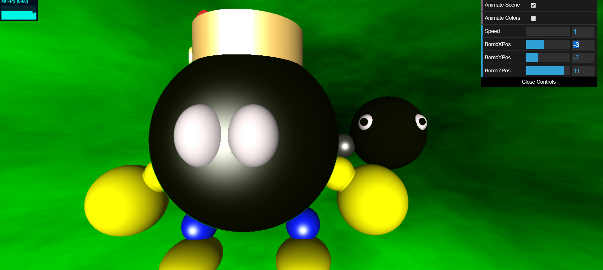
  
## Issues
- While doing the assignment I did everything except the Bounding Volume Hierarchy first, then went back to add it in and ran into issues. Working backwards after manipulating all the positions of shapes and attempting to define the bounding box spaces gave me trouble. Currently, the Bounding Volume Hierarchy is not working, however I left my attempt at it in the code. 

